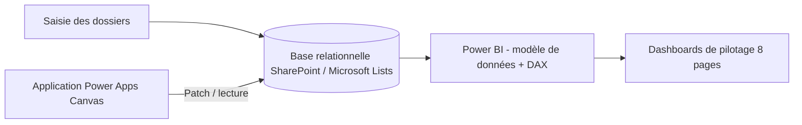
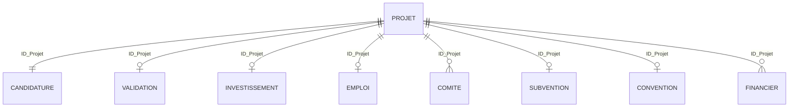
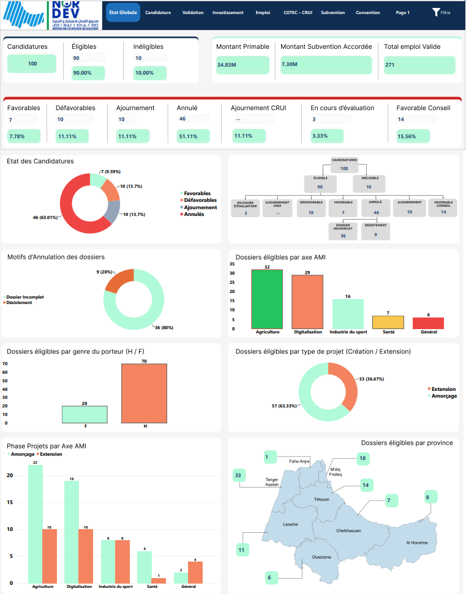
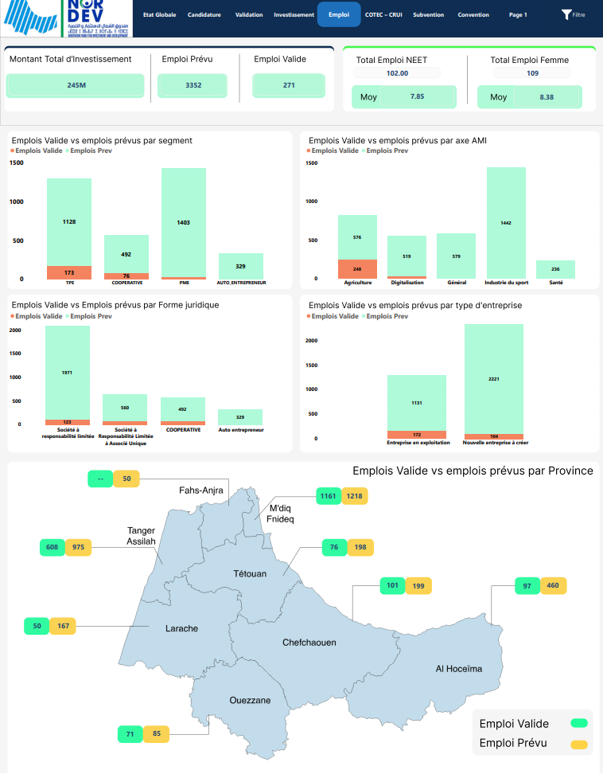
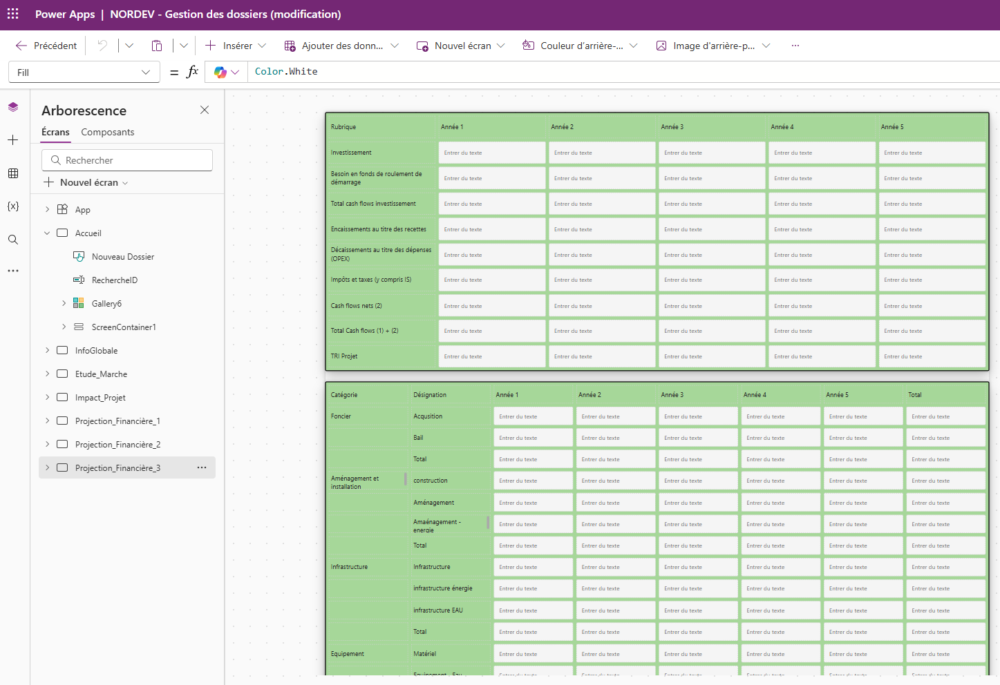

# NORDEV — Analytics & Gestion des dossiers d'un fonds d'investissement

    

**Digitalisation complète d'un fonds public d'investissement régional : base de données relationnelle, application métier et tableaux de bord de pilotage pour 100 dossiers représentant 245 M MAD.**

🇬🇧 [English version at the end](#-english-version)

## Contexte
NORDEV est un fonds public régional qui accorde des subventions à des projets d'entreprises (agriculture, digitalisation, industrie du sport, santé). Avant ce système : évaluation et suivi manuels des dossiers — lent, source d'erreurs, impossible à piloter en temps réel entre les comités.

## Architecture technique

## Modèle de données (simplifié)
Une liste centrale **Projets** reliée à 7+ listes par la clé **ID_Projet** :

## Ce que j'ai construit — côté technique
**1. Base de données relationnelle (SharePoint / Microsoft Lists)**
- 7+ listes liées par un identifiant projet unique (ID_Projet), pensées pour un suivi multi-phases
- Structuration des champs par phase du cycle de vie du dossier (candidature → évaluation → subvention → convention)

**2. Application métier Power Apps (Canvas)**
- Formulaires multi-écrans, dont des écrans financiers couvrant à eux seuls **plusieurs centaines de champs**
- Écriture des données vers SharePoint via **Patch**, règles de gestion et contrôles de saisie
- **Calcul automatique des scores d'éligibilité et des primes** selon des seuils métier : emploi créé, montant d'investissement, critères d'inclusion (genre, jeunes, handicap)

**3. Power BI (8 pages)**
- Modèle de données relationnel, **mesures DAX** pour les KPIs (taux d'éligibilité, montants primables vs accordés, emplois validés vs prévus)
- Transformations en **Power Query (M)**, dont un **Gantt des délais de traitement par phase** construit en M
- Cartes interactives par province, funnel de décomposition des statuts, drill par axe / segment / forme juridique
- Suivi des comités d'évaluation, des subventions et des conventions signées

## Résultats
- **100 dossiers** gérés de bout en bout : **245 M MAD** d'investissement, **3 350+ emplois prévus**
- **11 sessions de comités** suivies avec leurs décisions
- Subventions suivies du prévu (73 M MAD) à l'accordé, jusqu'aux conventions signées
- Indicateurs d'inclusion pour le pilotage (part des emplois féminins et jeunes)
- Scoring automatisé remplaçant l'évaluation manuelle

## Captures d'écran
> ⚠️ Toutes les captures sont anonymisées. Aucun nom réel, identifiant ou donnée personnelle.

- [ ] `images/etat-global.png` — page État global : KPIs + funnel des statuts
- [ ] `images/emploi.png` — emplois validés vs prévus + carte des provinces
- [ ] `images/subvention.png` — subventions : primable vs signée
- [ ] `images/gantt-delais.png` — Gantt des délais de traitement par phase
- [ ] `images/app-dossier.png` — Power Apps : écran de saisie d'un dossier
- [ ] `images/app-scoring.png` — Power Apps : calcul automatique score & prime

## Stack
SharePoint / Microsoft Lists · Power Apps (Canvas, Patch, règles de gestion) · Power BI (DAX, Power Query M, drill-through, cartes) · modélisation relationnelle · coordination des agents de saisie

---

# 🇬🇧 English version

**Full digitalization of a regional public investment fund: relational database, business application and steering dashboards for 100 applications worth 245M MAD.**

**What I built:** a SharePoint/Microsoft Lists relational database (7+ lists linked by a central project ID); a multi-screen Power Apps (Canvas) case-management app — financial screens alone cover several hundred fields — writing to SharePoint via Patch, with business rules and **automatic calculation of eligibility scores and grant amounts** (employment, investment and inclusion criteria); an 8-page Power BI dashboard with DAX measures, Power Query (M) transformations including a **processing-time Gantt per phase**, interactive province maps and status funnels.

**Results:** 100 applications end-to-end (245M MAD, 3,350+ planned jobs) · 11 committee sessions tracked · grants monitored from planned (73M MAD) to signed agreements · automated scoring replacing manual evaluation. *All screenshots anonymized.*
